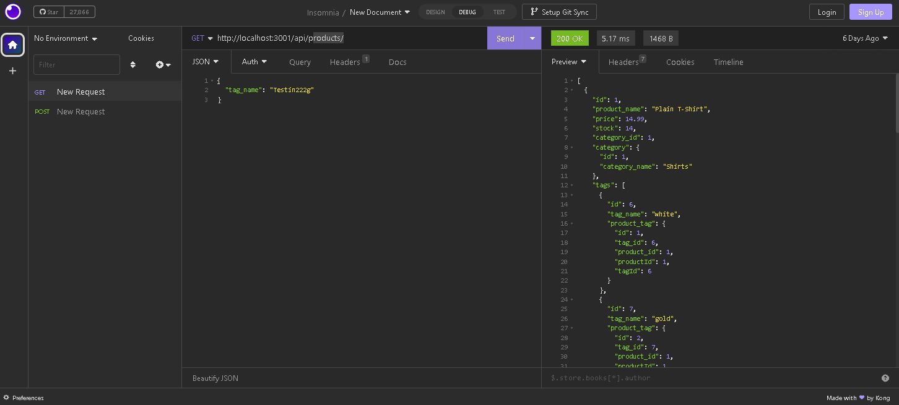

# E-Commerce-BE

## Description

This app is for an e-commerce website to be able to create a database using the latest technologies. This will allow for us to be able to compete with other sites!

- My motivation for this was to use DRY code to create a functioning e-commerce website.
- I built this to help me with future projects, and become familiar with sequelize.
- In doing this I learned how to use keys a little more!

## Table of Contents

- [Installation](#installation)
- [Usage](#usage)
- [Credits](#credits)

## Installation

After copying the repo to your local machine you must set up your '.env' file and then run your mysql commands to create the db before running npm i, and then npm seed. After doing so you can use npm start to run your local server.

Once these steps are concluded you can use insomnia and the CRUD method to add to the database and expand your on website, or if need be remove items as the sell out or go out of season!

## Usage

demo video: 'https://drive.google.com/file/d/1PTJwlfA2qbVA8PvxNu3bminQpKlxvoBt/view'

## Credits

- Juno Nguyen: tutor.
- Bootcamp material.
- As always, the lovely tool: Google!
